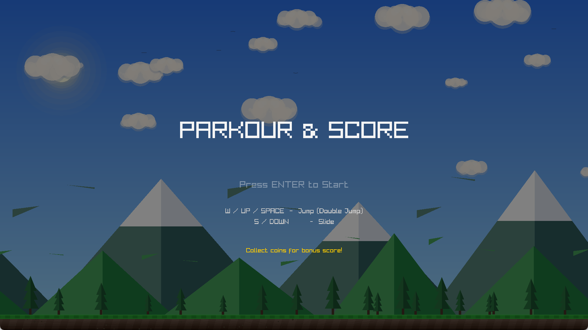

C++ 面向对象程序设计课程报告——跑酷游戏 "Parkour & Score"

1. 项目简介

本项目是一款名为 **"Parkour & Score"** 的横向卷轴跑酷游戏。玩家控制角色向前奔跑，通过跳跃（支持二段跳）和滑行躲避障碍物，同时收集金币获取积分。游戏包含昼夜交替背景、连击计分、护盾道具、复活功能及最高分记录。

开发目的：将本学期所学的 C++ 面向对象知识综合运用到一个完整的游戏项目中，通过实践加深对类、继承、多态、模板、STL 等概念的理解。

实现效果：8 种障碍物随机生成，金币链以 6 种图案排列，连击系统（3 连击 Combo、5 连击 Perfect），护盾提供 5 秒无敌，昼夜 120 秒循环，支持复活和最高分存档。

2. 开发环境与技术基础

- **操作系统**：Windows 11 x64
- **编译器**：MSVC v143 (Visual Studio 2022 Community)
- **图形库**：raylib 5.5（通过 vcpkg 管理）
- **C++ 标准**：C++17

用到的主要 C++ 知识点：

| 知识点 | 说明 |
|--------|------|
| 类与对象 | Entity、Player、Obstacle、Coin 等所有自定义类 |
| 封装 | 成员变量 private，公开接口 |
| 继承 | Player/Obstacle 继承 Entity |
| 多重继承 | Player 同时继承 Entity 和 ICollidable |
| 虚函数与重写 | Draw() 为虚函数，各子类重写实现多态 |
| 纯虚函数（接口） | ICollidable::GetCollisionRect() = 0 |
| 运算符重载 | ==、!=、=、<<、+=、-= |
| 友元函数 | operator<< 作为友元输出类信息 |
| 静态成员 | SoundManager 的静态实例和方法 |
| 单例模式 | SoundManager 类 |
| constexpr | 编译期常量定义 |
| 函数模板 | ObstacleTypeName<T>() |
| STL 容器 | std::vector 管理对象列表 |
| STL 算法 | std::find_if、std::remove_if、std::count_if |


3. 项目整体思路

### 类结构设计

采用**基类 + 接口**的层次设计：

```
IRenderable（绘制接口）
  └── Entity（基类：位置、尺寸、活动状态）
        ├── Player（玩家：跳跃、滑行、无敌）
        ├── Obstacle（障碍物：8种类型）
        ├── Coin（金币）
        ├── Shield（护盾道具）
        └── FloatingText（浮动文字）

ICollidable（碰撞接口）
  ├── Player
  └── Obstacle
```

### 模块划分

| 模块 | 文件 | 功能 |
|------|------|------|
| 入口主循环 | main.cpp | 窗口管理、游戏状态控制、地面绘制、HUD |
| 玩家控制 | Player.h/cpp | 重力模拟、二段跳、滑行、碰撞箱 |
| 背景系统 | Background.h/cpp | 云、山脉、松树、星空、日月、昼夜循环 |
| 障碍物管理 | ObstacleManager.h / obstacles.cpp | 障碍物生成、金币链、护盾、碰撞检测 |
| 音效管理 | SoundManager.h/cpp | 波形合成、单例模式 |
| 实体基类 | Entity.h | 位置封装、碰撞接口、渲染接口 |
| 对象池模板 | Pool.h | 泛型容器封装 |

### 主循环流程

```
while (窗口未关闭)
  ├─ 标题画面 → 等待 Enter
  ├─ 游戏中
  │   ├─ 更新速度（随距离递增）
  │   ├─ background.Update()  背景滚动
  │   ├─ player.Update()      重力/跳跃/滑行
  │   └─ obsManager.Update()  生成障碍物/碰撞/计分
  ├─ 游戏结束
  │   ├─ R 键复活 / Enter 重开
  │   └─ 音效延迟播放
  └─ 绘制
      ├─ background.Draw()  天空→星星→日月→云→飞鸟→山脉→松树
      ├─ 地面（草地+泥土+视差深度线）
      ├─ player.Draw()
      ├─ obsManager.Draw()
      └─ HUD / 标题 / GameOver 文字
```

## 4. 核心功能代码说明

### 4.1 玩家二段跳（Player::Update）

玩家类维护 `jumpCount` 和 `maxJumps`（值为 2）实现二段跳：

- 在地面时按下跳跃键，执行第一段跳，`jumpCount` 置 1
- 空中若 `jumpCount < maxJumps`，允许第二段跳，力度略微降低（乘 0.95）
- 落地时 `jumpCount` 归零

短跳优化：上升过程中松开跳跃键，额外施加 1.5 倍重力，角色快速下落，手感更跟手。

重力模拟：每帧 `velocity.y += gravity`（0.46），再更新 `posY += velocity.y`，最后地面碰撞检测防止穿模。

### 4.2 昼夜循环与视差背景（GameBackground::Draw）

通过 `cycleTimer` 计算昼夜进度（120 秒一周期），在 7 个关键帧之间插值天空颜色，实现蓝天→橙色日落→深蓝夜晚→红色日出→蓝天渐变。

太阳和月亮沿弧线运动：白天太阳从东到西，日出日落带镜头光晕；夜晚月亮带辉光和陨石坑细节。

背景元素按不同速度分层滚动（视差效果）：

| 元素 | 速度倍率 | 说明 |
|------|----------|------|
| 星空 | speed × 0.01 | 最慢，夜晚闪烁 |
| 远景山脉 | speed × 0.1 | 雪顶，偏蓝绿色 |
| 飞鸟 | speed × 0.02 | 翅膀扇动动画 |
| 云朵 | speed × 0.03 | 多层半透明圆球合成 |
| 近景山脉 | speed × 0.1+ | 绿色，无雪顶 |
| 松树 | speed × 0.6 | 最快，三层三角形叠加 |

### 4.3 波形合成音效（SoundManager::GenerateSFX）

所有音效通过波形合成实时生成，无需外部音频文件。函数接受起始频率、结束频率、时长、振幅、波形类型 5 个参数，在内存中生成 PCM 采样数据后加载为 Sound 对象。

```cpp
// 每种音效的合成参数示例
跳跃音效     = GenerateSFX(300, 800, 0.12, 0.4, 1);   // 方波，频率上升
金币音效     = GenerateSFX(1000, 1800, 0.08, 0.35, 0); // 正弦波
游戏结束音效 = GenerateSFX(400, 60, 0.8, 0.5, 2);      // 锯齿波，频率下降
```

波形类型：正弦波（柔和）、方波（尖锐）、锯齿波（低沉）。音量包络加入淡入淡出防止爆音。

## 5. 程序运行展示

- ：显示 "PARKOUR & SCORE" 标题、操作说明和按 Enter 开始提示
- **图2 白天游戏**：蓝天白云、远景雪山、近景松树，玩家正在奔跑，顶部显示分数
- **图3 滑行动作**：玩家按下 S 键滑行，碰撞箱变扁，从激光下方通过
- **图4 金币连击**：连续收集金币触发 "COMBO!" 或 "PERFECT!" 提示
- **图5 护盾道具**：收集护盾后角色带护盾特效，5 秒内碰撞障碍物不死亡
- **图6 游戏结束**：显示 GAME OVER、最终得分、最高分和复活/重开提示

## 6. 开发遇到的问题与解决方法

### 问题 1：函数重复定义导致编译失败

编译报错 `error C2084: 函数 "void Player::Draw(void) const" 已有主体`。

原因：Player.cpp 中 Draw() 和 GetRect() 各写了两次，第一次在 143/189 行，第二次在 220/259 行，粘贴代码后忘了删旧的。

解决：删除重复的第二组定义，保留第一组，重新编译通过。

### 问题 2：vcpkg 找不到 pwsh.exe

编译链接成功但 applocal 阶段报错 `'pwsh.exe' 不是内部或外部命令`。

原因：系统未安装 PowerShell Core（pwsh），但 vcpkg 的脚本调用了它。

解决：vcpkg 自动回退到使用 Windows PowerShell（powershell.exe）继续执行，raylib.dll 和 glfw3.dll 仍被正确复制到输出目录，不影响最终程序运行。

### 问题 3：纹理加载失败无后备处理

最初直接使用 `texture.id` 未检查是否加载成功，图片缺失时程序崩溃。

解决：构造函数中增加 `hasTexture = (texture.id != 0)` 标志位。Draw() 中根据标志位选择渲染路径——有纹理用 DrawTexturePro，无纹理用 DrawRectangle 绘制纯色块。障碍物绘制也做了同样处理。

## 7. 课程学习心得

### 学习收获

通过本学期 C++ 面向对象课程的学习和实践，我掌握了以下核心知识：

**理论方面**：
- 理解了封装、继承、多态三大特性的实际用途。在本项目中，Entity 基类封装了位置和尺寸，Player 和 Obstacle 通过继承复用代码，IRenderable 接口通过多态统一了所有对象的绘制方式
- 明白了虚函数和纯虚函数的区别——纯虚函数定义接口规范，强制子类实现
- 运算符重载让自定义类型的使用更自然

**实践方面**：
- 使用 std::vector 结合迭代器管理动态对象集合
- 用模板编写了 Pool<T> 通用对象池，减少了重复代码
- 通过单例模式管理全局音效资源
- 用文件流实现最高分持久化

### 存在的不足

1. 未使用智能指针，存在手动 delete 可能遗漏的风险
2. 缺少异常处理（try-catch），库底层出错时可能直接崩溃
3. 设计模式仅使用了单例，可以引入工厂模式管理障碍物生成
4. 地面绘制代码集中在 main.cpp 中，可以抽出独立类

### 改进方向

- 学习使用智能指针（unique_ptr、shared_ptr）管理资源
- 增加异常处理提高健壮性
- 继续学习设计模式，优化代码结构
- 为关键模块编写单元测试

### 自学内容汇总

| 自学内容 | 应用场景 |
|----------|----------|
| raylib 图形库 | 窗口创建、纹理渲染、碰撞检测、音频播放 |
| 波形合成原理 | 用数学公式生成 PCM 音频数据 |
| 视差滚动 | 多层背景不同速度移动，营造立体感 |
| 缓动动画 | 无敌漂浮阶段用差值实现平滑移动 |
| 连击系统 | 计时器+计数器实现 Combo 判定 |
| 昼夜循环算法 | 时间进度插值控制天空颜色和日月位置 |
| 碰撞箱调整 | 站立/滑行使用不同碰撞箱，提升手感 |
